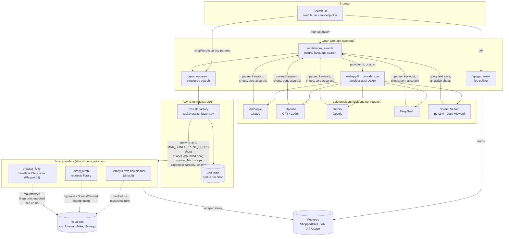
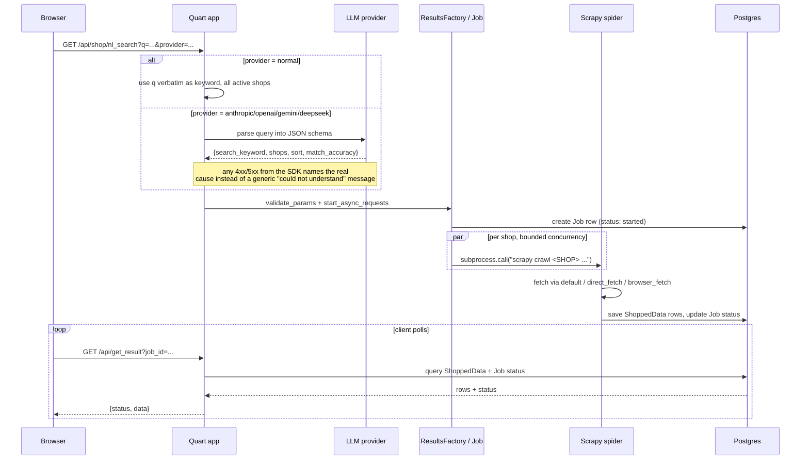

# Architecture

## Components

## Request flow: natural-language search

## Why spiders have three transport tiers

Most retail sites now fingerprint scrapers below the HTTP layer, so a single
transport doesn't work everywhere. Each spider in `shops/` opts into whichever
tier it actually needs, in `shop_base.py`:

| Tier | Flag | How | Used for |
|---|---|---|---|
| Default | *(none)* | Scrapy's own (Twisted) downloader | Sites with no meaningful bot detection (e.g. Newegg) |
| Direct | `use_direct_fetch = True` | Python `requests`, bypassing Scrapy/Twisted's network stack | Sites that fingerprint Twisted's connection signature specifically, but not a plain HTTP client (e.g. Macy's, TJ Maxx) |
| Browser | `use_browser_fetch = True` | Headless Chromium via Playwright, real Chrome channel, `sec-ch-ua` matched to the User-Agent | Sites with JS challenges or Client-Hints fingerprinting that block the other two (e.g. Amazon, Walmart, ASOS, Zara) |

Each search runs every active shop's spider concurrently rather than one at a
time (`ResultsFactory.start_search`, bounded by `MAX_CONCURRENT_SHOPS`), with a
separate, smaller cap (`MAX_CONCURRENT_BROWSER_SHOPS`) just for `browser_fetch`
shops - each one launches a real headless Chromium process, so letting all of
the general concurrency budget be browser shops at once can spike memory well
past what a small deployment has. A shop whose launch fails doesn't abort the
rest of the search; it's marked `error` and the others keep going.

A dead shop (its site no longer responding at all, not just blocking scrapers)
gets marked `active: False` in `shops/shop_util/shop_setup.py` rather than left
to time out on every search - see the `CUSHINE` entry there for an example.

## LLM providers

`webapp/llm_providers.py` is a small dispatch layer, not a framework: one
function (`extract_structured`) takes a system prompt, a user message, and a
JSON schema, and returns parsed JSON, regardless of which of the four SDKs
services the call. Adding a fifth provider means adding one `_extract_x`
function and one entry in `PROVIDER_LABELS` - nothing else in the app knows or
cares which provider handled a given request.

`/api/llm-providers.json` reports which providers actually have a key
configured on the running server (plus the always-available `normal`
pseudo-provider), which is what populates the model picker in the UI - so the
set of choices a user sees always matches what will actually work.

## Search relevance

Every search - LLM-parsed or `normal` - is filtered through
`ResultsFactory.match_sk()` with a minimum match-accuracy floor
(`MIN_MATCH_ACCURACY` in `webapp/nl_search.py`), so a search never runs fully
unfiltered. Without it, a shop that doesn't carry the searched item at all
still contributes its unrelated inventory to the results, and the cheapest of
that junk can end up misleadingly badged as "best price" client-side.
Matching itself uses whole-word boundaries and ignores filler words like
"for"/"with" (`STOPWORDS` in `tasks/results_factory.py`), rather than a plain
substring check, which used to false-positive-match "for" inside "force".

## Operational endpoints

`GET /health` is a liveness check (no api key required). `GET /openapi.json`
serves a machine-readable OpenAPI 3.0 description of the JSON API
(`webapp/openapi_spec.py`), maintained by hand alongside `api.md` since Quart
has no built-in OpenAPI generation.
