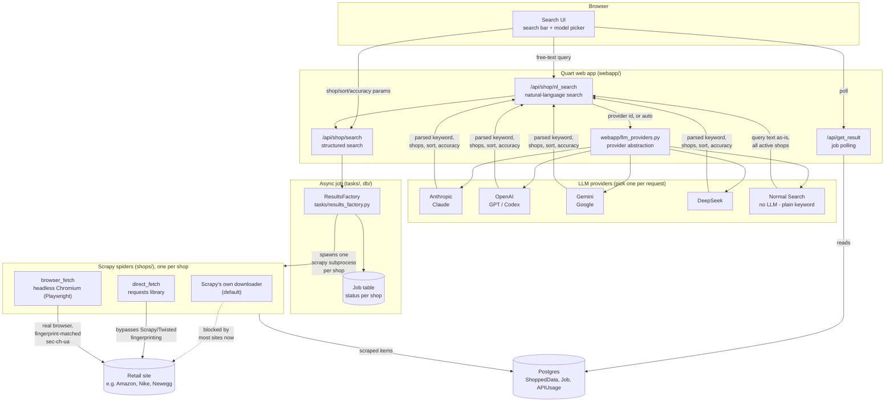
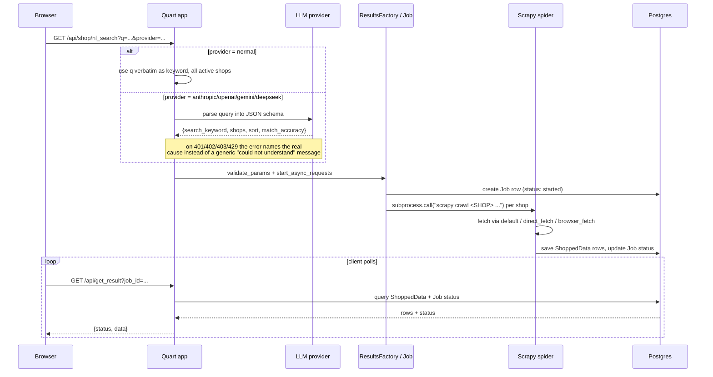

# Architecture

## Components

## Request flow: natural-language search

## Why spiders have three transport tiers

Most retail sites now fingerprint scrapers below the HTTP layer, so a single
transport doesn't work everywhere. Each spider in `shops/` opts into whichever
tier it actually needs, in `shop_base.py`:

| Tier | Flag | How | Used for |
|---|---|---|---|
| Default | *(none)* | Scrapy's own (Twisted) downloader | Sites with no meaningful bot detection (e.g. Newegg) |
| Direct | `use_direct_fetch = True` | Python `requests`, bypassing Scrapy/Twisted's network stack | Sites that fingerprint Twisted's connection signature specifically, but not a plain HTTP client (e.g. Macy's, TJ Maxx) |
| Browser | `use_browser_fetch = True` | Headless Chromium via Playwright, real Chrome channel, `sec-ch-ua` matched to the User-Agent | Sites with JS challenges or Client-Hints fingerprinting that block both of the above (e.g. Amazon, Nike) |

A handful of retailers (Walmart, H&M, Target's search API, ...) defeat all three
and need infrastructure this project doesn't have - residential IP rotation, in
Walmart's case, or a still-unidentified signing scheme for Target's API.

## LLM providers

`webapp/llm_providers.py` is a small dispatch layer, not a framework: one
function (`extract_structured`) takes a system prompt, a user message, and a
JSON schema, and returns parsed JSON, regardless of which of the four SDKs
services the call. Adding a fifth provider means adding one `_extract_x`
function and one entry in `PROVIDER_LABELS` - nothing else in the app knows or
cares which provider handled a given request.

`/api/llm-providers.json` reports which providers actually have a key
configured on the running server (plus the always-available `normal`
pseudo-provider), which is what populates the model picker in the UI - so the
set of choices a user sees always matches what will actually work.
